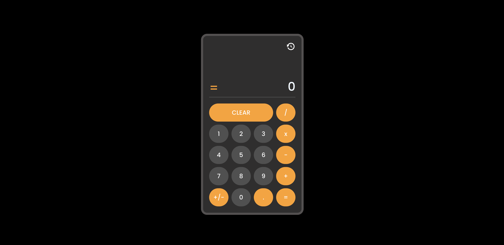

# 🧮 Simple Calculator

Welcome to **Simple Calculator**! This is a React-based calculator application that allows you to perform basic mathematical operations and keeps a history of all your calculations. 



## Features ✨

- 📱 **Simple and responsive design** for easy use on any device.
- ➕➖✖️➗ Supports **basic arithmetic operations** (addition, subtraction, multiplication, and division).
- 🕒 **History tracking**: View a list of your previous calculations.
- 🔄 **Clear functionality**: Easily reset the calculator or clear the history.

## Technologies Used 🚀

- **React** ⚛️: Frontend framework for building user interfaces.
- **Redux Toolkit** 🛠️: For managing application state, including the calculation history.
- **Sass** 🎨: For styling the application.
- **Vite** ⚡: As the build tool for fast development and production builds.
- **ESLint & Prettier** 🧹: For clean and consistent code.

## Installation 💻

To get started with this project, follow these steps:

1. Clone the repository:
    ```bash
    git clone https://github.com/stoyangalchev/simple-calculator.git
    ```

2. Navigate to the project directory:
    ```bash
    cd simple-calculator
    ```

3. Install the dependencies:
    ```bash
    npm install
    ```

4. Start the development server:
    ```bash
    npm run dev
    ```

The app will now be running on `http://localhost:5173`.

## Build for Production 🏗️

To create a production build, run:

```bash
npm run build
```

Then, you can preview the build locally:

```bash
npm run preview
```

## License 📜

This project is private. Feel free to modify it for your own use.

---

